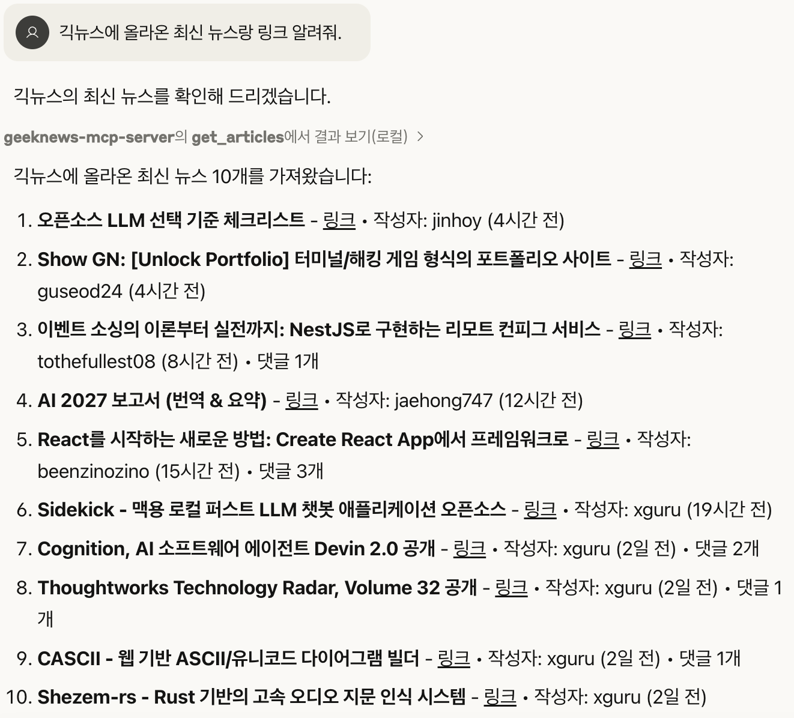

# GeekNews MCP Server

[](https://smithery.ai/server/@the0807/geeknews-mcp-server)

이 프로젝트는 [GeekNews](https://news.hada.io)에서 아티클을 가져오는 Model Context Protocol(MCP) 서버입니다. Python으로 구현되었으며, BeautifulSoup을 사용하여 웹 스크래핑을 수행합니다. 서버 부하를 줄이기 위해 하루에 한 번 자동으로 데이터를 파싱하고 캐시에 저장하는 기능을 제공합니다.

## 기능
|    |    |
|:-------------------------:|:-------------------------:|
|||

### 도구 (Tools)

- `get_articles` 도구: GeekNews에서 아티클을 가져오는 기능
  - 아티클 유형(top, new, ask, show)과 반환할 아티클 수를 지정할 수 있음
  - 각 응답에는 제목, URL, 포인트, 작성자, 시간, 댓글 수, 순위 정보가 포함됨
  - 캐시된 데이터를 사용하여 서버 부하 감소

- `get_weekly_news` 도구: GeekNews에서 주간 뉴스를 가져오는 기능
  - 특정 주간 뉴스 ID를 지정하거나 가장 최근 주간 뉴스를 가져올 수 있음
  - 주간 뉴스의 제목, 번호, ID, 내용, URL, 아이템 목록 등의 정보를 제공
  - 각 아이템에는 제목, URL, 순위 정보가 포함됨
  - 캐시된 데이터를 사용하여 서버 부하 감소

### 캐시 기능

- 하루에 한 번 자동으로 데이터를 파싱하고 캐시에 저장
- 캐시된 데이터가 유효한 경우 GeekNews 서버에 요청하지 않고 캐시된 데이터 사용
- 캐시 데이터는 24시간 동안 유효하며, 이후 자동으로 갱신
- 스케줄러가 주기적으로 캐시 유효성을 검사하고 필요시 갱신

## 사용법

- Smithery를 이용한 설치

   🚀 [geeknews-mcp-server](https://smithery.ai/server/@the0807/geeknews-mcp-server)

- MCP 설정 파일에 서버 정보를 추가

   ```json
   {
   "mcpServers": {
      "geeknews-mcp-server": {
         "command": "npx",
         "args": [
         "-y",
         "@smithery/cli@latest",
         "run",
         "@the0807/geeknews-mcp-server",
         "--key",
         "smithery에서 발급 받은 키"
         ]
      }
   }
   }
   ```

## 로컬 설치 방법

1. Git Clone

   ```bash
   git clone https://github.com/the0807/GeekNews-MCP-Server
   cd GeekNews-MCP-Server
   ```

2. uv로 환경 세팅

   ```bash
   uv sync
   ```

3. 가상환경 실행

   ```bash
   uv venv
   source .venv/bin/activate
   ```

4. MCP Inspector로 서버 테스트

   ```bash
   uv run mcp
   mcp dev main.py

   # 터미널에 나오는 URL(MCP Inspector)로 접속하여 서버 테스트
   ```

## 코드 구조

- `src/models.py`: 아티클 정보를 저장하는 데이터 클래스 정의
- `src/parser.py`: GeekNews 웹사이트의 HTML을 파싱하여 아티클 정보를 추출
- `src/client.py`: GeekNews 웹사이트에서 데이터를 가져오는 HTTP 클라이언트
- `src/config.py`: 설정과 상수 정의
- `src/cache.py`: 캐시 관리 기능 제공
- `src/scheduler.py`: 주기적인 데이터 갱신 스케줄러
- `src/server.py`: MCP 서버 구현
- `main.py`: 서버 실행 진입점

> [!Note]
> - 이 서버는 GeekNews 웹사이트의 HTML 구조에 의존합니다. 웹사이트 구조가 변경되면 파싱 로직을 업데이트해야 할 수 있습니다.
> - 캐시 데이터는 사용자의 홈 디렉토리 아래 `.cache/geeknews-mcp` 폴더에 저장됩니다.
